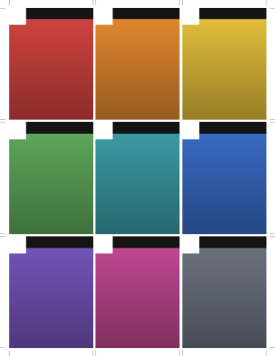

# Photo Sheet Printer

Arrange photos into a grid on one printable sheet and export a PDF — without
re-compressing your photos.

Nine 3×4 portraits on a sheet of Letter paper is the default. Everything runs
in the browser tab; there is no server, no upload, and no account.



---

## Why not just use any online collage tool

Most of them decode your photo, lay it out on a canvas, and re-encode the whole
sheet as a new JPEG. You get one generation of compression loss on every photo,
plus resampling to whatever resolution the canvas happened to be.

This tool copies the compressed bytes of your original file straight into the
PDF. For a JPEG, the bytes in the PDF are **the same bytes** that were in the
file — no decode, no re-encode, no resample. The PDF is a container, not a
re-render.

| Input | How it is stored | Result |
|---|---|---|
| JPEG (baseline or progressive, 8-bit) | original bytes copied in as a `DCTDecode` stream | byte-for-byte identical |
| PNG — grey, RGB or palette, no alpha, non-interlaced | original `IDAT` copied in as `FlateDecode` with the PNG predictor | byte-for-byte identical |
| PNG with alpha, or interlaced | decoded once, flattened onto white, stored losslessly | every pixel preserved, larger file |
| WebP, AVIF, GIF, BMP, TIFF | decoded once, stored losslessly | every pixel preserved, larger file |
| HEIC / HEIF | Safari only — Chrome and Firefox cannot decode it | every pixel preserved, larger file |

Embedded ICC colour profiles (Display P3 on iPhone photos, Adobe RGB, and so
on) are carried through to the PDF, so colours print the way the camera
intended. EXIF orientation is applied as a PDF transform rather than by
rotating pixels, which again avoids a re-encode.

### Expect a large file

This is the honest cost of the above. Nine 12-megapixel iPhone JPEGs are about
40 MB on disk, so the sheet is about 40 MB. Nothing is wrong. Any smaller
number would mean throwing away image data.

Two things that legitimately reduce it: repeating one photo across several
cells stores it only once, and PNG or HEIC sources are usually far larger than
JPEG ones.

---

## Running it

The page **must be served over HTTP.** Opening `index.html` straight from
Finder will not work: the Content-Security-Policy has no origin to match
against on a `file://` URL, so the browser blocks the scripts. The page will
tell you so rather than showing a blank screen.

### Docker

```bash
docker compose up
```

Then open <http://localhost:8080>.

### Without Docker

Any static file server pointed at `public/` will do:

```bash
python3 -m http.server 8080 --directory public
```

---

## Using it

1. **Add photos** — click the button, or drag files anywhere onto the page.
2. **Pick a shape.** The default keeps every cell at 3:4 and makes them as
   large as the page allows. Switch to *Exact print size* if you need cells
   that measure a specific number of inches, such as 2.5 × 3.5 wallet prints.
3. **Arrange.** Drag a photo onto another cell to swap them. Hover a cell for
   rotate and remove buttons. *Repeat to fill* copies what you have across
   every empty cell — useful when you want nine of the same portrait.
4. **Download PDF**, then print it at **100% / Actual size**. Do not let the
   print dialog "fit to page", or your exact sizes will not be exact.

### The ppi badge

Hovering a cell shows its effective print resolution — the photo's pixels
divided by the size it will actually be printed at.

- **300 ppi or more** — sharp, the usual target for photo printing
- **180–300** — fine at arm's length, slightly soft up close
- **below 180** — visibly soft; the photo is too small for a cell that size

The number changes as you resize cells, because it is a property of the
combination, not of the photo.

---

## Deploying it to your own site

The app is four static files. Copy `public/` to your web root and you are done.

```
public/
├── index.html
├── css/app.css
└── js/{image-source,layout,pdf,app}.js
```

**Set the security headers.** `docker/nginx.conf` contains a policy that has
been tested against this app; copy it into your own server config. The
important one is:

```
Content-Security-Policy: default-src 'none'; script-src 'self'; style-src 'self';
  img-src 'self' blob: data:; connect-src 'none'; object-src 'none';
  base-uri 'none'; form-action 'none'; frame-ancestors 'none'
```

`connect-src 'none'` is what turns "your photos never leave the browser" from a
promise into something the browser enforces — with it set, the page cannot open
a network connection even if someone modified the JavaScript.

`index.html` also carries the policy in a `<meta>` tag, so it still applies on
hosts where you cannot set headers (GitHub Pages, for instance). The meta tag
cannot express `frame-ancestors`, which is the one protection you lose there.

If you are copying the nginx config into an existing site, note that an
`add_header` inside a `location` block discards every header inherited from the
`server` block. That is why the config varies `Cache-Control` through a `map`
instead.

---

## Security notes

- No third-party code. No CDN, no analytics, no fonts, no frameworks — nothing
  is fetched at runtime, which is what lets the policy be this strict.
- No `eval`, no `innerHTML`. Filenames are written with `textContent`, so a
  photo named `` is inert.
- The container runs as a non-root user with a read-only root filesystem, all
  capabilities dropped, and `no-new-privileges`.
- Only `GET` and `HEAD` are answered; everything else gets a 405.

---

## How it works

Four files, no build step, no dependencies.

| File | Role |
|---|---|
| `js/image-source.js` | Parses JPEG and PNG headers and decides how the image can reach the PDF without being re-encoded. Reads EXIF orientation and ICC profiles. |
| `js/layout.js` | Grid geometry in PDF points. The preview and the PDF both read from here, so they cannot drift apart. |
| `js/pdf.js` | A small PDF writer. Written by hand rather than pulled from a library so the image bytes are under direct control. |
| `js/app.js` | Settings, preview, drag-and-drop, export. |

Three details worth knowing if you are modifying it:

**PNG passthrough works because of a coincidence in the formats.** PNG rows
carry a per-row filter byte, and PDF's `FlateDecode` supports exactly that
layout via `/Predictor 15`. So the compressed `IDAT` stream can be moved across
verbatim. It stops working when alpha is involved, because PNG interleaves
alpha with colour while PDF wants it split into a separate soft mask — those
images take the decode path instead.

**EXIF orientation is a matrix, not a rotation.** Each of the eight orientation
values maps to one of the eight symmetries of the square, applied as a PDF
`cm` transform. User rotation composes onto it the same way. Nothing rotates
pixels.

**Only the first Exif block counts.** Some encoders append a second one;
browsers orient by the first, and since the on-screen preview has to agree with
the PDF, this does too.

---

## Development

There is nothing to install and nothing to build. Serve the folder and edit the
files.

The `tests/` folder holds a harness that checks the parts that are easy to
break silently — that JPEG bytes survive intact, that all eight EXIF
orientations land the right way up, that grid geometry is centred and correctly
sized, and that ICC-tagged photos produce a PDF that actually renders. That
last one exists because getting it wrong produced a valid 40 MB PDF of blank
white paper.

---

## Licence

MIT — see [LICENSE](LICENSE).
